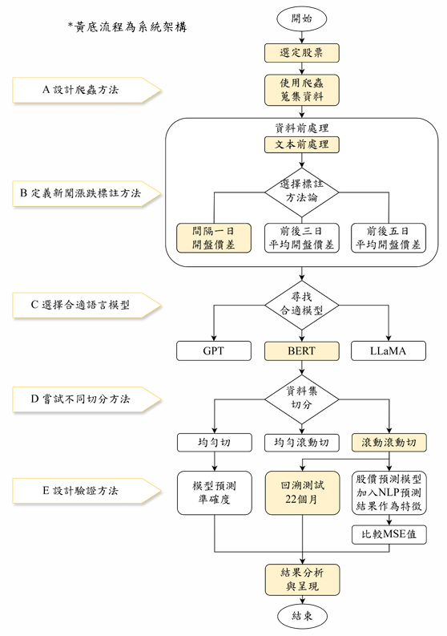

# SmartStock Forecast 📈

利用新聞標題進行股價漲跌預測的 NLP 系統  
A Django-based NLP platform for forecasting stock price trend and simulating automated investment strategies.

👉 [點我觀看首頁介面影片](https://drive.google.com/file/d/1znLUg5sbLUwWPSjtNGznw1GR07FSxsUM/view?usp=drive_link)


---

## 📌 專題簡介

本研究開發一套**結合自然語言處理 (NLP)** 與 **股市資料分析**的預測系統，透過分析新聞標題，預測四家台灣電子股（鴻海、台積電、聯發科、日月光）的漲跌趨勢，並設計**一鍵式投資策略模擬平台**。使用者只需輸入股票代碼，即可自動完成爬蟲、預測、回測並產出報表。
備註：回溯測試區間為 2023/01 ~ 2024/10

**研究成果包含：**
- 📊 NLP 預測模型準確度達 60%
- 💰 實驗組策略平均年投報率高達 38.70%
- 🧠 採用 CKIP BERT + 滾動切分 + 回測模擬
- 🖥️ 前後端整合 Django 操作介面

---

## 🧠 系統架構

### 📊 系統流程圖

以下為本專題整體流程設計架構圖：




1. 使用者輸入目標股票（名稱與代碼）
2. 系統執行爬蟲抓取新聞與股價
3. 自動進行 NLP 標註 → CKIP BERT 預測漲跌
4. 將預測結果加入技術分析條件，回測投資策略
5. 產出圖表與結果

---

## 🖥️ 安裝與執行方式

```bash
# 1. 複製此專案
git clone https://github.com/Tsaili-17/SmartStock-Forecast.git
cd SmartStock-Forecast

# 2. 安裝虛擬環境（可選）
python -m venv venv
venv\Scripts\activate

# 3. 安裝必要套件
pip install -r requirements.txt

# 4. 執行 Django
python manage.py runserver

---

## 📦 專案結構說明
資料夾	功能簡述
dashboard/	Django 後端主程式
dashboardapp/	Django Views / Models / Routing
template/	前端 HTML 模板頁面
static/	CSS / 圖片資源
data/	模型權重檔案（透過 Git LFS 管理）
requirements.txt	Python 套件清單
manage.py	Django 主入口

## 🧪 實驗結果摘要
股票	實驗組年投報率	對照組年投報率
聯發科	62.04%	41.40%
鴻海	28.44%	26.88%
台積電	27.12%	28.80%
日月光	37.20%	31.20%
平均年投報率提升 20.67%，高於台股大盤表現。

## 👨‍💻 開發團隊
國立清華大學 工業工程與工程管理學系
指導老師：陳建良 教授
成員：謝欣妤、陳采笠、裘家欣

## 🛡️ 免責聲明（Disclaimer）
本專案為國立清華大學工業工程與工程管理學系專題成果，主要用於學術研究與技術展示之目的。
專案中所使用之模型與數據僅供模擬分析，不構成任何形式的投資建議或保證準確性與獲利性。
使用者請自行判斷與承擔相關風險，開發團隊不對因本系統使用所產生之任何損失負責。

## 📌 僅供參考（For Reference Only）
本系統內容包含之資料處理、預測方法、視覺化介面與模型訓練流程，皆基於課程訓練與學術探討目的進行設計。
若有商業應用或擴充需求，建議在專業人員指導下進一步調整與驗證。
